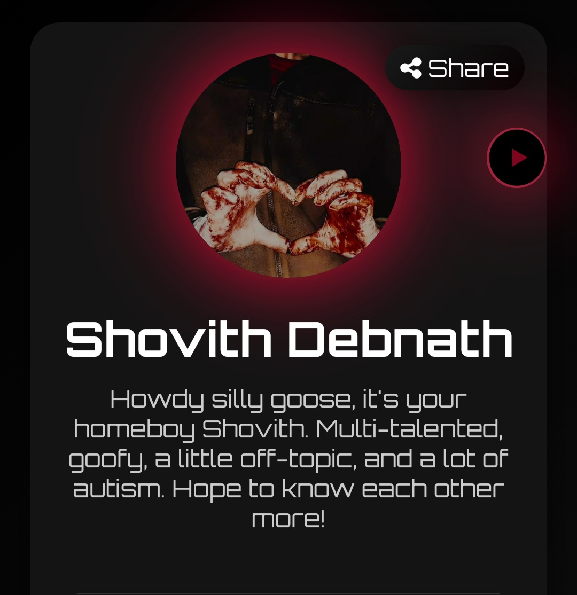
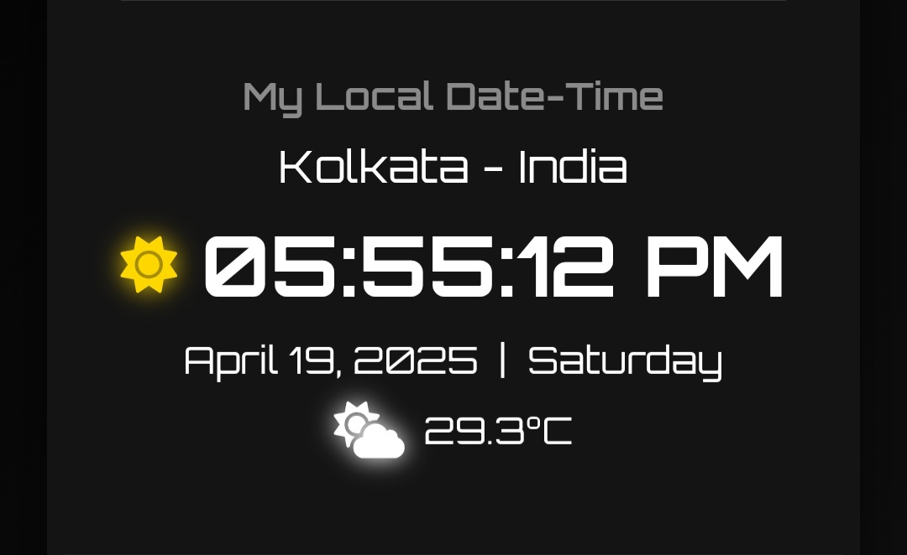

Yo people!
We’ve all tried those link-in-bio thingies like Lintree, Bedlam GG, or whatever’s trending — either to flex our gamer stats or just dump all our random links in one place, right?

Well… instead of dropping cash on that, I thought — why not just make my own? Because if you can build it, why buy it? (Or maybe I’m just a hyperfixated autistic gremlin — who knows.)

Silly stuff aside, c’mon — let me show you around!

---
## Loader

So, when you first load up the site, you’ll see a little loader animation. Yup — totally “borrowed” it from Uiverse.io because hey... it was free, and I couldn’t resist. Hehehe...

## Content
Then — bam! — the webpage slowly fades in with a smooth ease-in effect (because we fancy like that).

You’ll spot a picture spot where you can slap any photo you want. (I swear I’m a good person deep down)
Next up: your name and a little blurb about yourself. Make it cool, weird, mysterious — your call.

YES! That red glow you’re seeing? It’s just a fancy box-shadow doing its thing.

Oh — and see that tiny play button sneaking in from the side? Yup, that’s the background music control. Give it a tap if you dare — it’s totally worth it ’cause the track’s by none other than Charli XCX. I’d definitely press it if I were you.

Next up — there’s a local clock showing my current time, date, day, and even a cute little day/night icon, plus the weather and temperature.

I grabbed the weather info using a free API key from Tomorrow.io (because we love free stuff, right?). And for the location part, I used the latitude and longitude of my area, so it’s super accurate — like, creepily accurate.

Pretty cool, huh?

Check live website here :-
https://hawkay002.github.io/Link/
